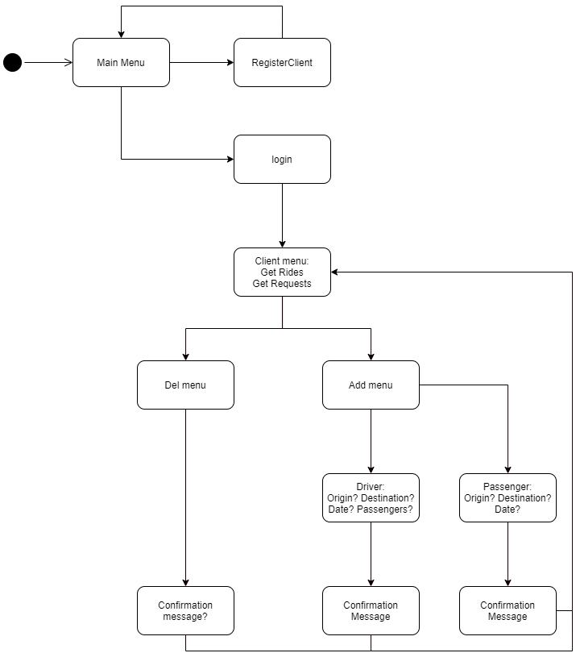

# Application 3 - ACID

## RideTogether

This is a Client-Server application simulating a *ride app* such as BlaBlaCar. All interaction is done by running python scripts using a console.

___
## How to use 

Open a minimum of 3 terminals — one server and two clients (at least one driver and one passenger).

1 - Initiating Server:
```sh
    python .\server.py
```

2 - Initiating Clients:
```sh
    python .\client.py
```

> Note: To close the applications press `CTRL+C`

___
## Functionalities

The user interface was done only as a auxiliary tool for the application. For this reason, no complex UI was built, but rather a simple interaction via the console. The following diagram was created to better illustrate the flow of interaction with the user.

<div style="text-align: center">

</div>

Initially, a user can perform three operations: *login*, *registration*, and *exit*.

* **Registration menu**: prompts to enter a name, e-mail , and password to create new client in the system.
* **Login**: done using the e-mail and password.

A client/user — after login — can subscribe to a service as a driver or a passenger, inserting the following parameters:

* **Driver**: origin, destination, date and maximum number of passengers in the car;
* **Passenger**: origin, destination and date.

These subscriptions indicate the user's interest in a ride, whether it is by being a driver os a passenger. To simulate the "matches" between clients (a driver being available for a passenger and vice-versa) a callback notification is used to inform the user when it's subscription has been met.

The user can also delete a specific subscription by its unique ID, meaning they will not be notified in the future for new matches regarding this ride.
